# Manjaro как основная система

Эта ветка предназначена для установки Manjaro на компьютер, где система будет занимать весь диск.

> [!CAUTION]
> При установке на весь диск все находящиеся на нём данные будут удалены. Перед продолжением нужно убедиться, что выбран правильный компьютер и на диске нет нужных файлов.

## Этапы

1. Скачать образ Manjaro
2. Скачать Rufus
3. Записать образ на USB-флешку
4. Загрузить компьютер с флешки
5. Запустить Manjaro без установки и проверить оборудование
6. Установить систему на диск
7. Выполнить первое обновление и базовую настройку
8. Проверить готовность системы к дальнейшей работе

Каждый этап оформляется непосредственно во время установки на чистый рабочий компьютер.

## 1. Скачивание образа Manjaro

На этом этапе мы только скачиваем установочный образ. Флешку пока не записываем.

### Что понадобится

- другой компьютер с работающей операционной системой и доступом в интернет;
- USB-флешка объёмом не менее 8 ГБ;
- компьютер с 64-битным процессором Intel или AMD, на который будет установлена Manjaro.

> [!WARNING]
> На следующем этапе содержимое выбранной флешки будет полностью удалено. Если на ней есть нужные файлы, заранее скопируйте их в другое место.

### Какую редакцию выбрать

В этом пособии используется официальная редакция **Manjaro GNOME**.

Почему GNOME:

- это одна из трёх официальных редакций Manjaro;
- в полной редакции уже есть обычный графический рабочий стол и базовые программы;
- все дальнейшие скриншоты и названия элементов интерфейса в этой ветке будут соответствовать GNOME.

Не выбирайте Community Editions и Minimal-образ, если вы проходите пособие впервые: дальнейшие экраны и набор установленных программ могут отличаться.

### Скачать образ

1. Откройте [официальную страницу загрузки Manjaro](https://manjaro.org/products/download/x86/).
2. Найдите раздел **GNOME**.
3. Нажмите **Download**.
4. Сохраните файл с расширением `.iso` в папку загрузок.

На момент проверки пособия, 3 сентября 2026 года, официальный сайт предлагает образ:

```text
manjaro-gnome-26.1.0-260812-linux71.iso
```

> [!NOTE]
> Версия Manjaro со временем изменится. Если имя скачанного файла новее указанного выше, но файл получен из раздела GNOME на официальном сайте, это нормально. Для пособия важна редакция GNOME, а не точное совпадение номера версии.

### Результат этапа

В папке загрузок должен находиться один файл вида:

```text
manjaro-gnome-<версия>-linux<версия_ядра>.iso
```

Полный образ Manjaro GNOME занимает примерно **5 ГБ**. Если файл весит заметно меньше или имеет расширение `.crdownload` либо `.part`, загрузка ещё не завершилась. Точный размер может немного отличаться в зависимости от версии.

Не распаковывайте ISO-файл и не копируйте его на флешку как обычный файл. На следующем этапе мы правильно запишем из него загрузочную флешку.

## 2. Скачивание Rufus

Rufus — программа для создания загрузочной USB-флешки из ISO-образа. Устанавливать её в Windows не требуется: достаточно скачать и запустить файл.

### Скачать Rufus

1. Откройте [официальный сайт Rufus](https://rufus.ie/).
2. Если сайт не открывается, включите VPN и обновите страницу.
3. Пролистайте страницу до раздела **Download**.
4. Выберите актуальную версию Rufus, подходящую для вашей Windows и архитектуры компьютера. Для большинства современных компьютеров подходит стандартная версия **Windows x64**.
5. Сохраните файл с расширением `.exe` в папку загрузок.

> [!NOTE]
> Номер версии Rufus со временем меняется, поэтому в пособии не используется прямая ссылка на конкретный установочный файл.

### Результат этапа

В папке загрузок должны находиться два файла:

```text
manjaro-gnome-26.1.0-260812-linux71.iso
rufus-<версия>.exe
```

На следующем этапе мы запустим Rufus и запишем образ Manjaro на USB-флешку.

## 3. Запись образа Manjaro на USB-флешку

> [!CAUTION]
> Все файлы на выбранной флешке будут удалены. Перед началом перенесите с неё нужные данные и внимательно проверьте выбранное устройство.

1. Подключите USB-флешку объёмом не менее 8 ГБ.
2. Запустите скачанный файл Rufus. Если Windows запросит разрешение на внесение изменений, нажмите **Да**.
3. В поле **Устройство** выберите нужную флешку. Проверьте её название, букву и объём.
4. Нажмите **ВЫБРАТЬ** и укажите скачанный ISO-файл Manjaro.

После выбора образа Rufus может сообщить, что обнаружен образ **ISOHybrid** и будет применён режим записи **DD**. Это нормально: нажмите **OK**.

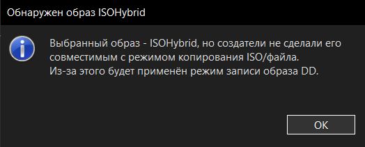

Перед началом записи окно Rufus должно выглядеть примерно так:


Проверьте два поля:

- **Устройство** — выбрана именно нужная USB-флешка;
- **Метод загрузки** — выбран ISO-файл Manjaro.

Остальные параметры в режиме DD недоступны и менять их не требуется. Галочку **Проверить на плохие блоки** ставить не нужно.

5. Нажмите **СТАРТ**.
6. Rufus ещё раз предупредит, что данные на флешке будут уничтожены. Если устройство выбрано правильно, нажмите **OK**.
7. Дождитесь окончания записи. Не закрывайте Rufus и не извлекайте флешку во время процесса.

> [!WARNING]
> После записи Windows может предложить отформатировать флешку. Нажмите **Отмена**: форматирование уничтожит записанный образ Manjaro.

### Результат этапа

Когда Rufus снова покажет состояние **Готов**, загрузочная флешка создана. Закройте программу и безопасно извлеките флешку.


## 4. Загрузка компьютера с флешки

Загрузочная флешка готова. Теперь нужно запустить с неё Manjaro. На этом этапе система ещё не устанавливается на диск: сначала откроется меню загрузки, а затем — рабочий стол Live-системы.

### Подключить флешку и войти в BIOS/UEFI

1. Полностью выключите компьютер.
2. Подключите загрузочную флешку к USB-порту. На стационарном компьютере надёжнее использовать порт на задней панели материнской платы.
3. Включите компьютер и сразу несколько раз нажимайте клавишу входа в BIOS/UEFI. Чаще всего это **Delete** или **F2**, реже — **F10**, **F12** или **Esc**. Нужная клавиша обычно кратко указана на первом экране после включения.


После входа откроется BIOS/UEFI. Его внешний вид и названия пунктов зависят от производителя материнской платы, но нужные настройки обычно находятся в разделе **Boot**.

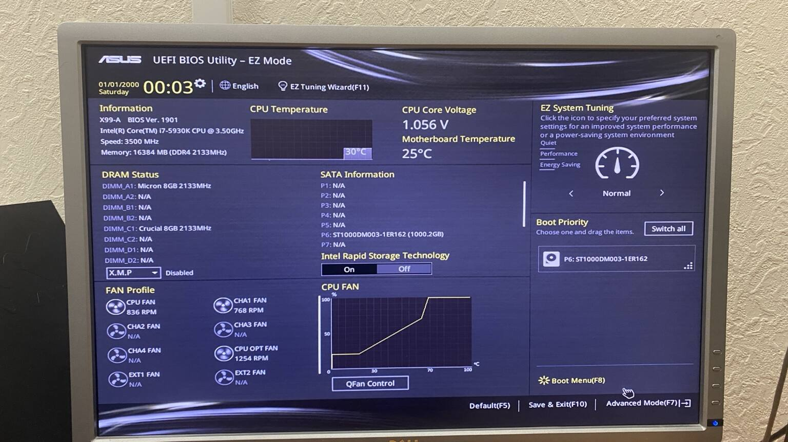

Если открылся упрощённый режим (**EZ Mode**), найдите кнопку перехода в расширенный режим (**Advanced Mode**). На показанной плате ASUS для этого используется клавиша **F7**.

### Отключить Secure Boot

Manjaro обычно загружается при отключённой проверке Secure Boot.

1. Откройте раздел **Boot**.
2. Найдите подраздел **Secure Boot**. Иногда он расположен внутри разделов **Security**, **Authentication** или **Advanced**.


На плате из примера параметр **OS Type** изначально установлен в **Windows UEFI mode**.


3. Измените **OS Type** на **Other OS**. На других платах вместо этого может быть отдельный параметр **Secure Boot**, который нужно установить в **Disabled**.


> [!NOTE]
> Пункт **Other OS** не удаляет Windows и не устанавливает другую систему. Он только отключает обязательную проверку Microsoft Secure Boot, чтобы прошивка разрешила загрузить Manjaro.

### Поставить флешку первой в очереди загрузки

1. В разделе **Boot** найдите блок **Boot Option Priorities**, **Boot Priority** или **Boot Order**.
2. Для **Boot Option #1** выберите флешку. Если она показана дважды, выбирайте вариант, начинающийся с **UEFI:**.
3. Системный SSD или HDD оставьте вторым — **Boot Option #2**.

В примере флешка определяется как `UEFI: KingstonDataTraveler 3.0`, а внутренний диск — как `P6: ST1000DM003-1ER162`.


> [!WARNING]
> Название флешки и диска на вашем компьютере будет другим. Ориентируйтесь на производителя, модель и объём устройства. Не выбирайте случайный диск только потому, что он находится первым в списке.

4. Сохраните настройки и выйдите из BIOS/UEFI. Обычно для этого используется **F10** и подтверждение **Save & Exit**.

Компьютер перезагрузится и должен открыть меню загрузки Manjaro.

### Выбрать видеодрайвер

В меню Manjaro оставьте часовой пояс, раскладку и язык без изменений: их можно нормально настроить уже в графическом установщике.


Выбор зависит от видеокарты:

- **Intel** — выбирайте **Boot with open source drivers**;
- **AMD Radeon** — выбирайте **Boot with open source drivers**;
- **NVIDIA GeForce** — обычно выбирайте **Boot with proprietary drivers**. Для используемой в этом пособии **GeForce GTX 750 Ti** нужен именно этот вариант;
- если после выбора драйвера появляется чёрный экран, зависание или изображение с артефактами, перезагрузитесь и попробуйте второй вариант. После установки системы драйвер можно подобрать точнее через Manjaro Hardware Detection.

> [!NOTE]
> **Boot with open source drivers** для NVIDIA обычно означает свободный драйвер `nouveau`. Это не то же самое, что официальный модуль NVIDIA `nvidia-open`. Старые карты на архитектуре Maxwell, включая GTX 750 Ti, не используют `nvidia-open`.

Geant4 выполняет физические расчёты в основном на процессоре. Видеодрайвер нужен прежде всего для рабочего стола и OpenGL-визуализации геометрии и событий.

Выберите подходящий вариант стрелками на клавиатуре и нажмите **Enter**. Начнётся загрузка Live-системы Manjaro.

### Результат этапа

Должен открыться рабочий стол Manjaro GNOME. Это ещё не установка: система работает с флешки. Не извлекайте её — на следующем этапе мы проверим оборудование и только после этого запустим установку Manjaro на диск.

## 5. Проверка Live-системы

После загрузки откроется рабочий стол Manjaro и окно **Manjaro Hello**.

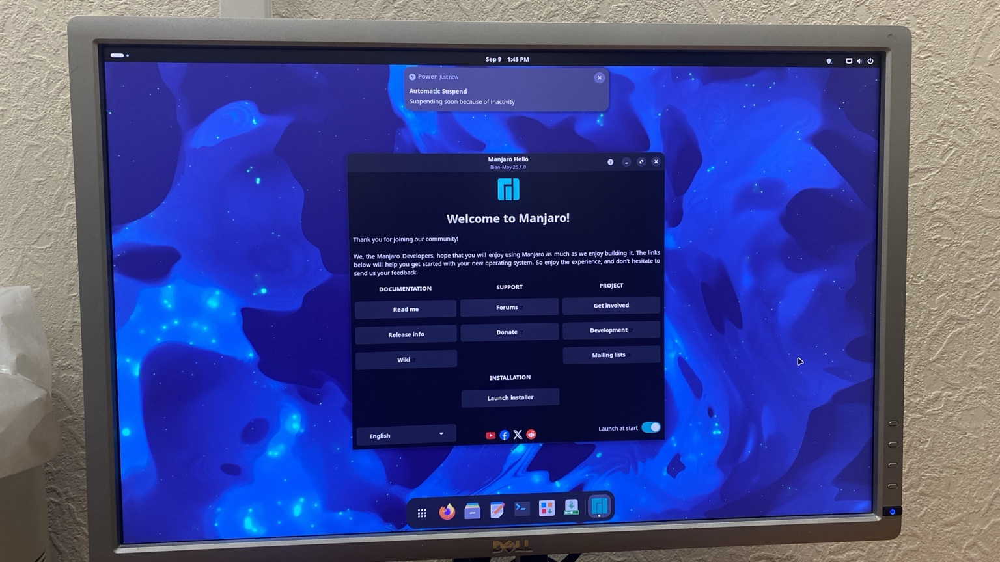

Пока система работает с флешки, быстро проверьте:

- изображение выводится без полос, артефактов и зависаний;
- клавиатура и мышь работают;
- компьютер подключается к интернету;
- видны все подключённые мониторы;
- звук работает, если он понадобится на этом компьютере.

Если основное оборудование работает, в левом нижнем углу окна **Manjaro Hello** выберите **Русский** и нажмите **Launch installer**. Откроется программа установки Manjaro.

## 6. Установка Manjaro на диск

### Язык установщика

Выберите **русский** и нажмите **Далее**.


### Регион и часовой пояс

Укажите свой регион и часовой пояс. Для Санкт-Петербурга и Москвы подходят:

- регион — **Европа**;
- зона — **Москва**.


Нажмите **Далее**.

### Раскладка клавиатуры

В качестве основной раскладки выберите **English (US)** и вариант **Default**. Так пароль всегда можно будет ввести латиницей на экране входа. Русскую раскладку добавим после установки системы.

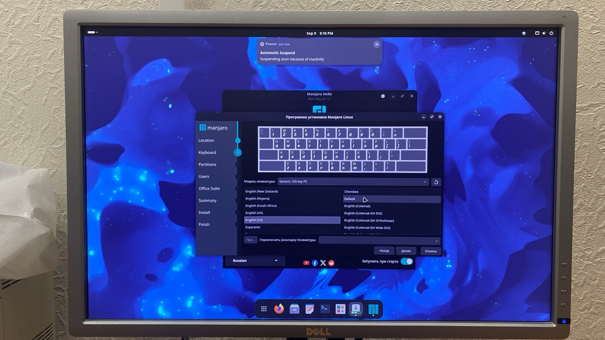

Нажмите **Далее**.

### Выбор диска и разметка

> [!CAUTION]
> Следующие действия полностью удалят Windows, программы и личные файлы с выбранного диска. Проверьте модель и объём диска ещё раз.

1. В верхнем списке выберите диск, на который устанавливается Manjaro.
2. Выберите **Стереть накопитель**.
3. В качестве файловой системы оставьте **ext4**.

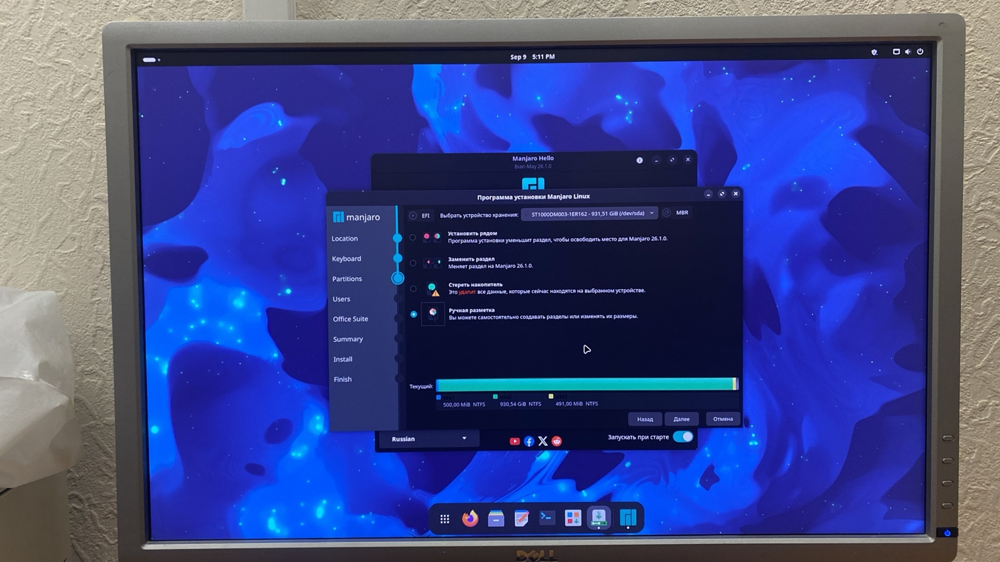

Для обычной установки на весь диск ручная разметка не нужна. Если открылось окно с таблицей разделов `/dev/sda1`, `/dev/sda2` и кнопками **Создать**, **Править**, **Удалить**, нажмите **Назад** и выберите **Стереть накопитель**.

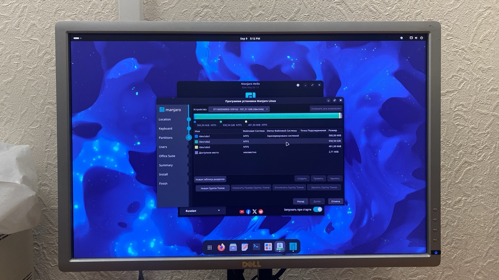

### Настройка swap

Swap — резервная область на диске, которую Linux использует при нехватке оперативной памяти. Она значительно медленнее RAM, особенно на HDD, но может спасти программы от аварийного завершения.

Откройте список под параметром **Стереть накопитель**.

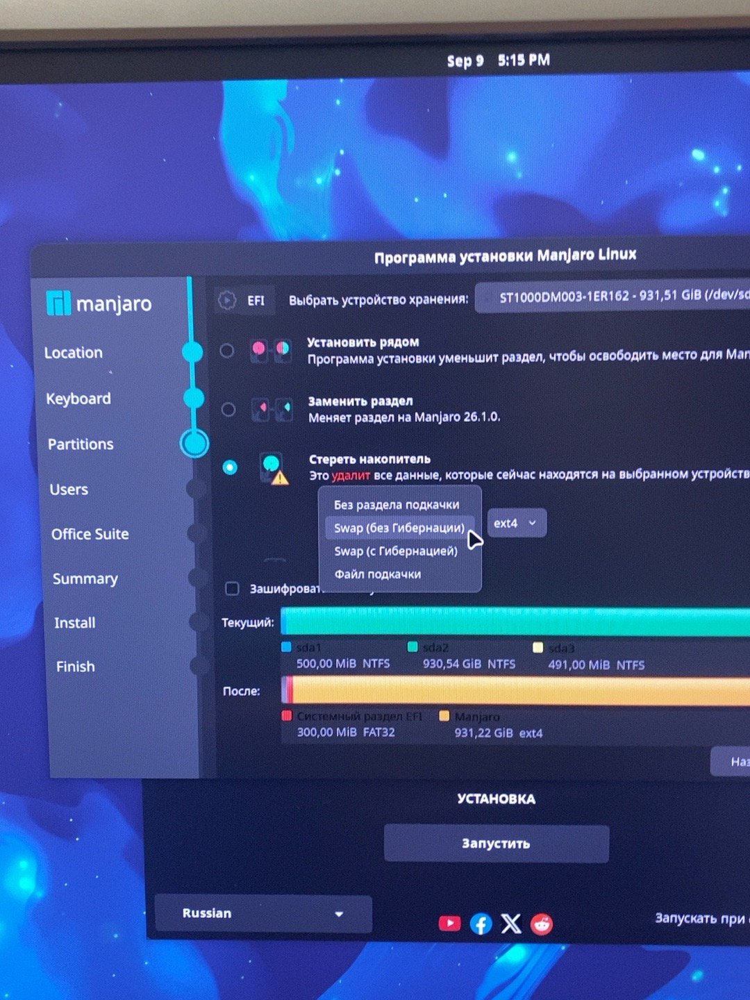

Выберите **Файл подкачки**. Его проще изменить или удалить после установки, чем отдельный раздел. Варианты с гибернацией в этом пособии не используются.

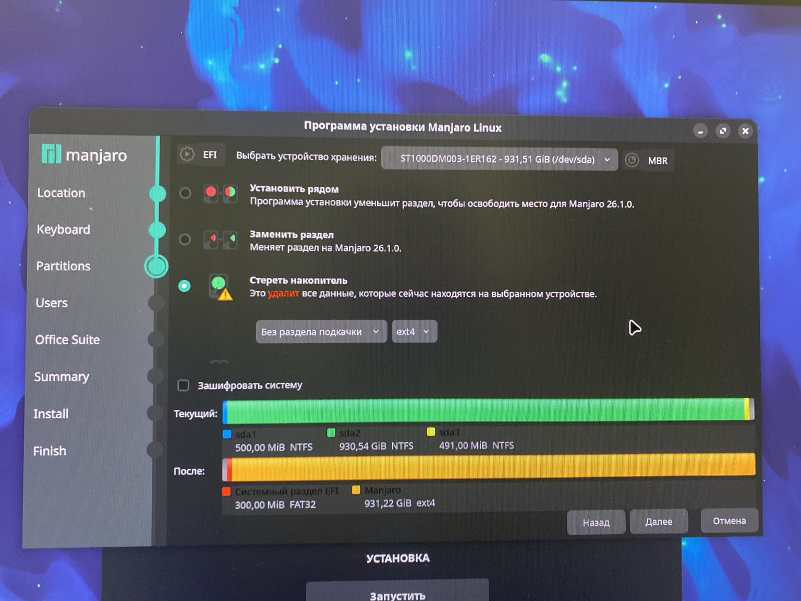

Перед продолжением должны быть выбраны:

- правильный внутренний диск;
- **Стереть накопитель**;
- **Файл подкачки**;
- **ext4**;
- шифрование системы выключено, если оно вам специально не требуется.

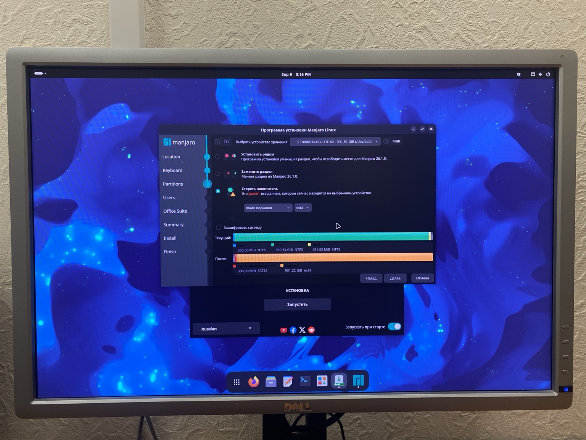

Нажмите **Далее**.

### Создание пользователя

Заполните поля:

- отображаемое имя — можно использовать русские или латинские буквы;
- имя для входа — только латинские буквы в нижнем регистре, цифры, дефис и подчёркивание, без пробелов;
- имя компьютера — латинскими буквами, без пробелов;
- пароль — придумайте пароль и повторите его во втором поле.


Автоматический вход лучше не включать. Галочку **Использовать тот же пароль для аккаунта администратора** оставьте включённой. Нажмите **Далее**.

### Офисный пакет

Для Linux и Geant4 офисный пакет не требуется, поэтому в этом пособии выбирается **No Office Suite**. При необходимости LibreOffice можно установить позже.

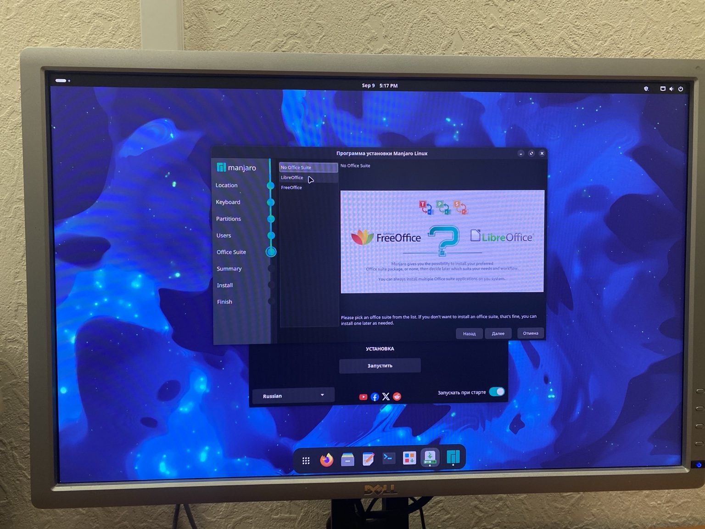

Нажмите **Далее**.

### Проверка перед установкой

На странице **Summary** внимательно проверьте:

- выбран правильный диск;
- указано, что диск будет очищен;
- создаётся таблица разделов GPT;
- создаются EFI-раздел и основной раздел `ext4`;
- имя пользователя и часовой пояс указаны правильно.

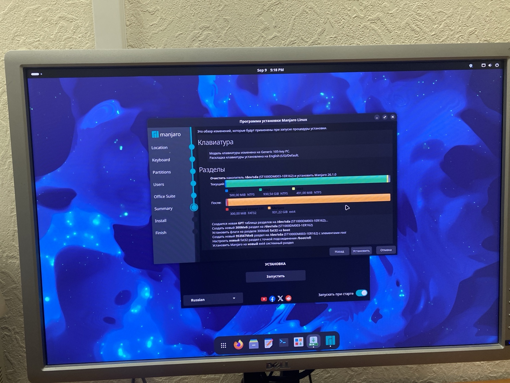

Если всё правильно, нажмите **Установить**, затем подтвердите **Установить сейчас**.

Во время установки не выключайте компьютер и не извлекайте флешку. Если появляется предупреждение об автоматическом переходе в спящий режим, пошевелите мышью или временно отключите автоматическое засыпание в настройках питания Live-системы.

### Результат этапа

Начнётся копирование файлов и установка Manjaro на внутренний диск. Дождитесь сообщения о завершении установки. Следующий этап — первая перезагрузка уже в установленную систему.

## 7. Первая загрузка и обновление системы

### Завершение установки

После копирования файлов установщик покажет сообщение **Готово**.

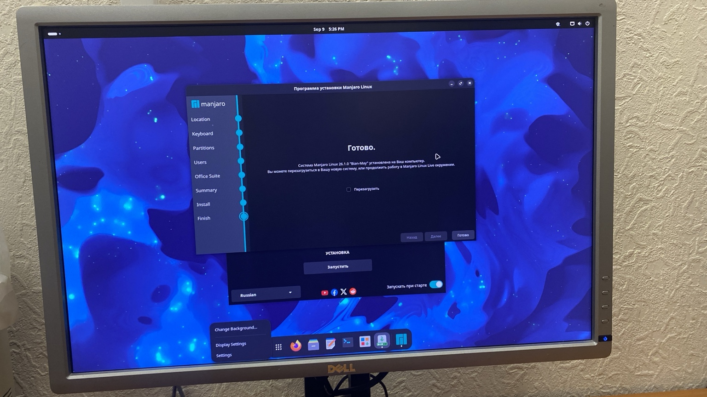

1. Поставьте галочку **Перезагрузить**.
2. Нажмите **Готово**.
3. Когда экран погаснет и начнётся перезагрузка, извлеките установочную флешку.

Выключать компьютер отдельно не требуется. Если флешка осталась подключённой, но загрузилась установленная система, ничего страшного не произошло: извлеките флешку и ещё раз перезагрузите компьютер. Если снова открылось меню Live-системы, выключите компьютер, извлеките флешку и включите его заново.

После входа в установленную Manjaro приветственное окно можно закрыть.

### Русская раскладка и терминал

Чтобы добавить русскую раскладку, откройте **Настройки → Клавиатура → Источники ввода**, нажмите **+** и добавьте русскую раскладку. Стандартное сочетание GNOME для переключения раскладки — **Super + Space**; при желании его можно изменить в настройках клавиатуры.

Проверьте сочетание **Ctrl + Alt + T**. Если терминал не открылся, создайте пользовательское сочетание клавиш:

1. Откройте **Настройки → Клавиатура → Просмотр и настройка комбинаций клавиш → Пользовательские комбинации**.
2. Нажмите **+**.
3. В поле **Название** укажите любое понятное название, например `Терминал`.
4. В поле **Команда** обязательно укажите:

   ```text
   kgx
   ```

5. Назначьте сочетание **Ctrl + Alt + T** и сохраните его.

Теперь **Ctrl + Alt + T** должно открывать GNOME Console.

### Первое обновление

Убедитесь, что компьютер подключён к интернету, откройте терминал и выполните:

```bash
sudo pacman -Syu
```

При вводе пароля символы в терминале не отображаются — это нормально. Введите пароль и нажмите **Enter**. Если система спросит о продолжении установки, подтвердите его нажатием **Enter**.

Не закрывайте терминал и не выключайте компьютер до окончания обновления. Когда снова появится строка приглашения для ввода команды, обновление завершено.


Предупреждения о `consolefont`, отсутствии каталога ключей Secure Boot или о том, что корневая файловая система не является `btrfs`, сами по себе не означают ошибку обновления.

После большого первого обновления перезагрузите компьютер.

## 8. Проверка установленной системы

После перезагрузки откройте терминал и проверьте файл подкачки:

```bash
swapon --show
```

В выводе должна присутствовать строка `/swapfile` с типом `file`. Размер файла создаётся установщиком автоматически и может отличаться.

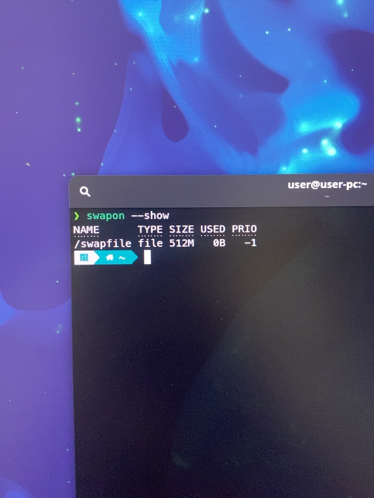

Установка Manjaro завершена, если:

- компьютер загружается с внутреннего диска без установочной флешки;
- интернет, клавиатура, мышь и изображение работают;
- система полностью обновлена;
- команда `swapon --show` показывает активный файл подкачки.

На этом ветка установки Manjaro завершена. Дальнейшая установка Geant4 рассматривается отдельно.
