# Manjaro в виртуальной машине VirtualBox

Этот маршрут устанавливает Manjaro GNOME внутри Oracle VirtualBox на компьютере с Windows. Основная Windows остаётся на месте: все действия с диском выполняются внутри отдельного файла виртуальной машины.

Такая система подходит для изучения Linux, сборки Geant4, запуска примеров и обычной OpenGL-визуализации. Производительность будет ниже, чем при установке Linux непосредственно на компьютер, но для обучения это безопасный и удобный вариант.

## Этапы

1. Скачать Manjaro и установить VirtualBox
2. Создать виртуальную машину
3. Настроить процессор, память, диск и графику
4. Запустить Live-систему Manjaro
5. Установить Manjaro на виртуальный диск
6. Извлечь ISO после установки
7. Добавить русскую раскладку и горячую клавишу терминала
8. Обновить систему
9. Проверить Guest Additions и включить общий буфер обмена
10. Создать общую папку между Manjaro и Windows

## 1. Подготовка файлов

Понадобятся:

- компьютер с Windows 10 или Windows 11;
- не менее 16 ГБ оперативной памяти на основном компьютере для конфигурации из этого примера;
- около 100 ГБ свободного места на диске;
- ISO-образ **Manjaro GNOME**;
- установщик **Oracle VirtualBox for Windows hosts**.

Скачайте ISO с [официального сайта Manjaro](https://manjaro.org/products/download/x86/). Подробная проверка ISO описана в маршруте [Manjaro как основная система](../01-manjaro/README.md#1-скачивание-образа-manjaro).

VirtualBox скачайте с [официальной страницы загрузок](https://www.virtualbox.org/wiki/Downloads). Для Windows нужен файл с расширением `.exe` из раздела **Windows hosts**.

### Установка VirtualBox

Запустите скачанный `.exe`. В окне выбора компонентов оставьте стандартные параметры и нажмите **Далее**.

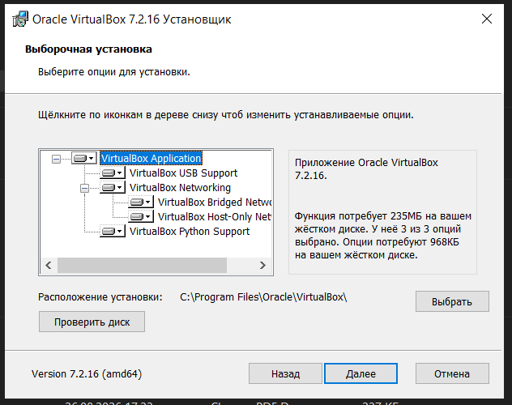

Во время установки VirtualBox может кратковременно отключить сетевые подключения и запросить разрешение Windows на установку драйверов. Подтвердите запросы и дождитесь открытия **Oracle VirtualBox Менеджера**.

## 2. Создание виртуальной машины

При первом запуске VirtualBox предлагает выбрать режим интерфейса. Для этого маршрута достаточно **Базового режима**: все дополнительные параметры при необходимости всё равно доступны через вкладку **Расширенные**.

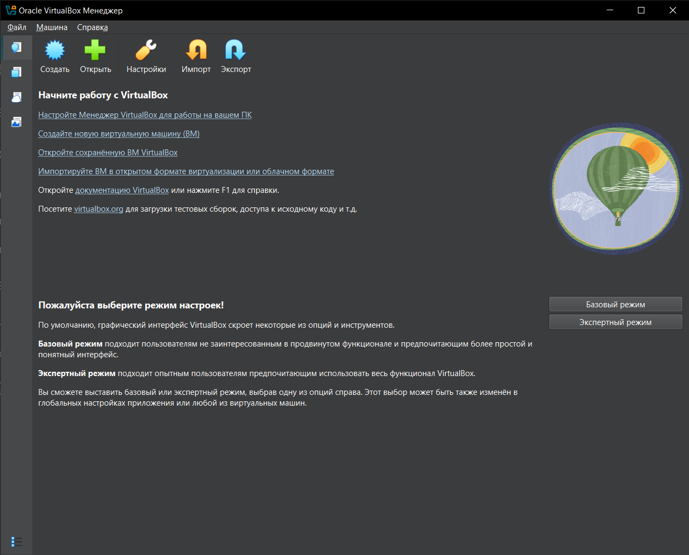

Нажмите **Создать**.

### Имя и ISO-образ

1. В поле **Имя ВМ** укажите понятное имя, например `manjaro`.
2. Папку ВМ можно оставить стандартной. Именно там будут храниться конфигурация и виртуальный диск.
3. В поле **Образ ISO** выберите скачанный ISO Manjaro.

До выбора ISO VirtualBox может ошибочно предложить другой дистрибутив Linux. Ориентироваться на него не нужно.

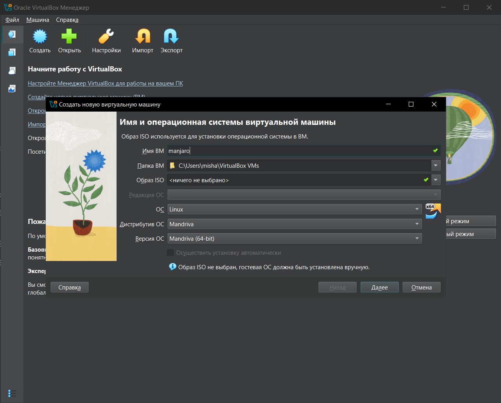

После выбора ISO должны определиться:

- **ОС:** Linux;
- **Дистрибутив ОС:** ArchLinux;
- **Версия ОС:** Arch Linux (64-bit).

Manjaro основан на Arch Linux, поэтому это правильное определение. Сообщение о невозможности автоматической установки тоже нормально: в этом маршруте Manjaro устанавливается вручную через её собственный установщик.

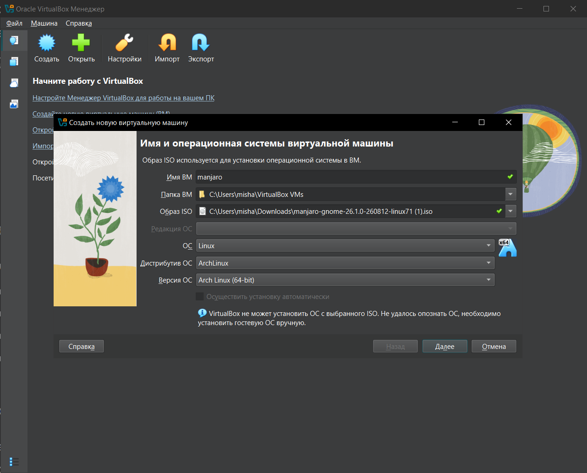

Нажмите **Далее**.

## 3. Выделение ресурсов

Ресурсы, отданные виртуальной машине, недоступны основной Windows, пока ВМ запущена. Поэтому не передавайте ей всю память и все логические процессоры.

На следующем снимке показан **плохой вариант**: виртуальной машине отданы почти все 14 ГБ доступной памяти и все 8 потоков процессора. Windows при такой настройке может начать зависать.

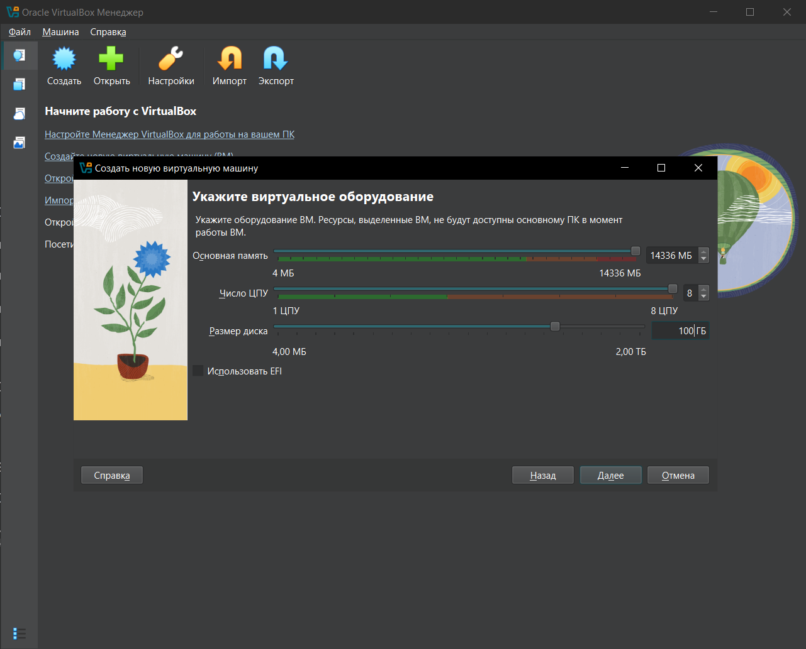

Для компьютера с 16 ГБ RAM и 8 логическими процессорами используйте:

- **оперативная память:** 8192 МБ;
- **процессоры:** 4;
- **размер виртуального диска:** 100 ГБ;
- **EFI:** выключено для проверенной в этом маршруте установки через обычный BIOS и MBR.

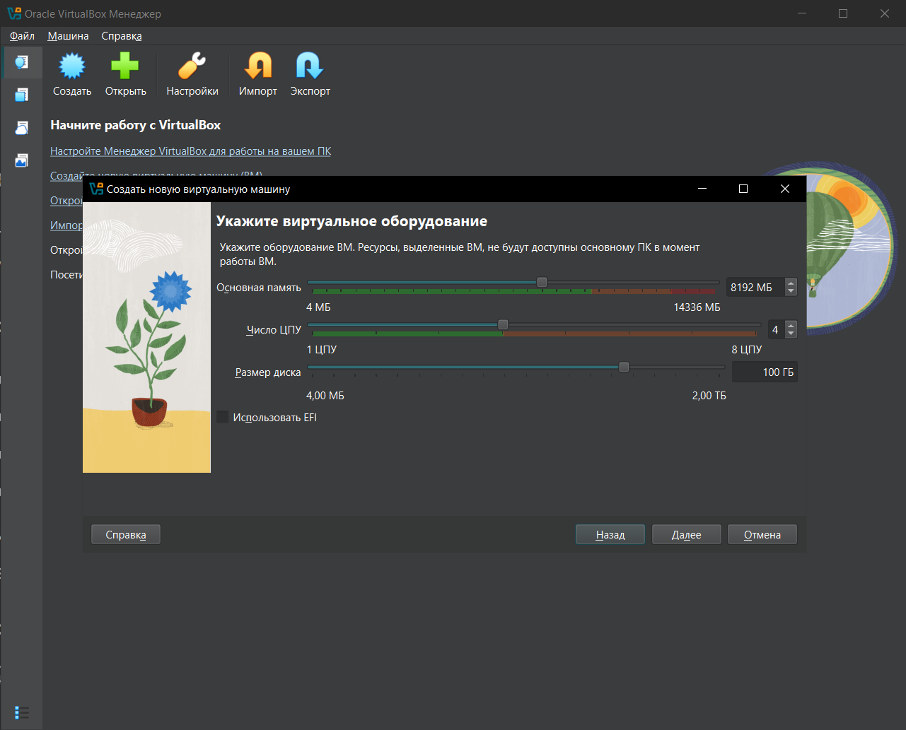

Виртуальный диск создаётся динамически расширяемым: значение 100 ГБ задаёт его максимальный размер, но файл не займёт все 100 ГБ сразу.

Если основной компьютер слабее, не выходите за зелёную зону ползунков и оставьте Windows не менее половины оперативной памяти и процессорных потоков.

Нажмите **Далее**, проверьте итоговую сводку и нажмите **Готово**.

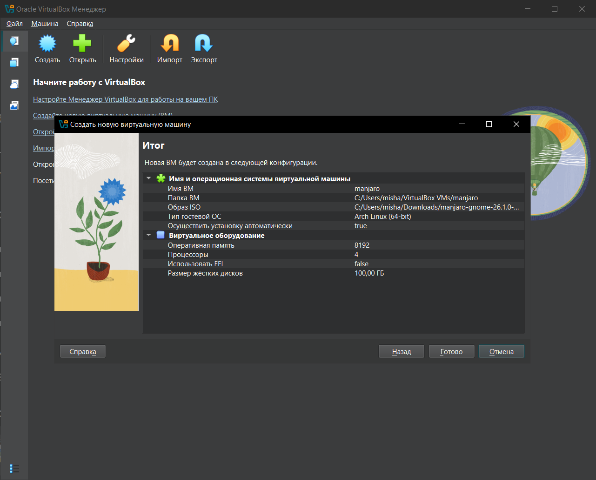

После создания ВМ появится в списке VirtualBox. На этом этапе видеопамять может быть установлена всего в 16 МБ — перед запуском её нужно изменить.

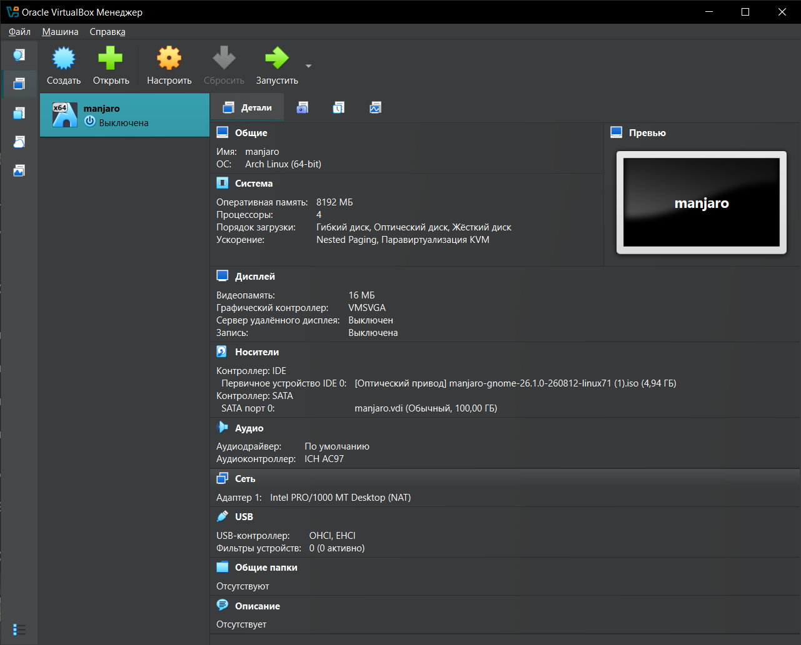

## 4. Настройка графики

Выделите выключенную ВМ и нажмите **Настроить → Дисплей**.

Для Manjaro GNOME установите:

- **видеопамять:** 128 МБ;
- **число виртуальных мониторов:** 1;
- **графический контроллер:** VMSVGA;
- **3D-ускорение:** включено.

128 МБ здесь — память виртуального видеоконтроллера, а не вся видеопамять физической видеокарты. Выделять виртуальной машине несколько гигабайт VRAM не требуется и в этом окне невозможно. Geant4 выполняет физические расчёты на процессоре; графика используется главным образом для визуализации.

После изменения видеопамяти в сводке должно отображаться 128 МБ.

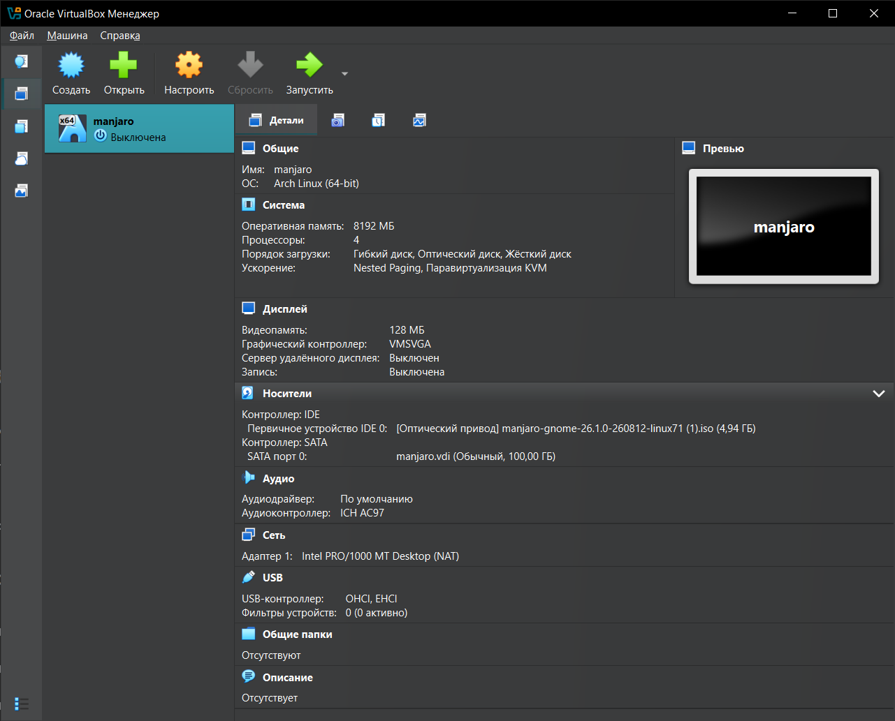

В **Базовом** режиме страницы дисплея переключателя 3D-ускорения может не быть.

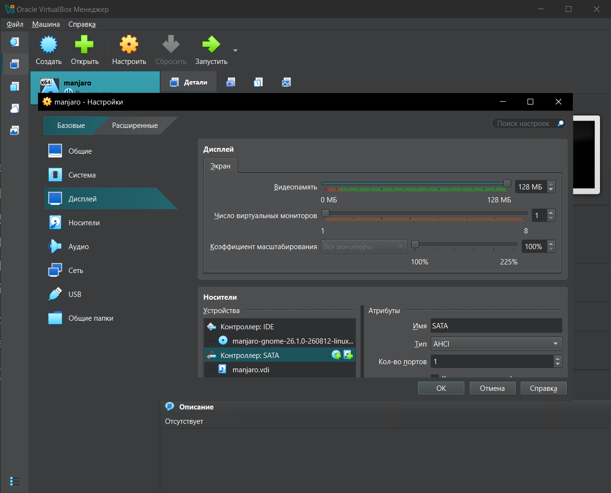

Перейдите на вкладку **Расширенные**, снова откройте **Дисплей** и включите **3D-ускорение**. Контроллер оставьте **VMSVGA**.

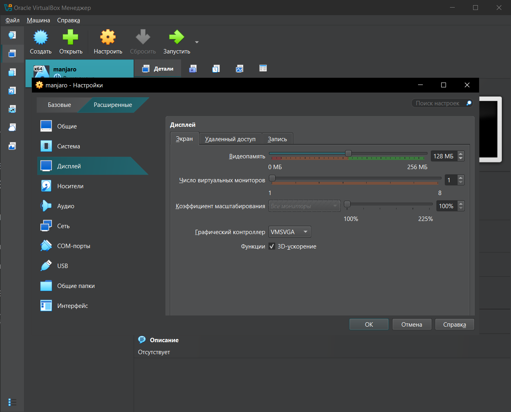

Нажмите **ОК**. Сеть можно оставить в стандартном режиме **NAT** — для скачивания пакетов и работы с Geant4 этого достаточно.

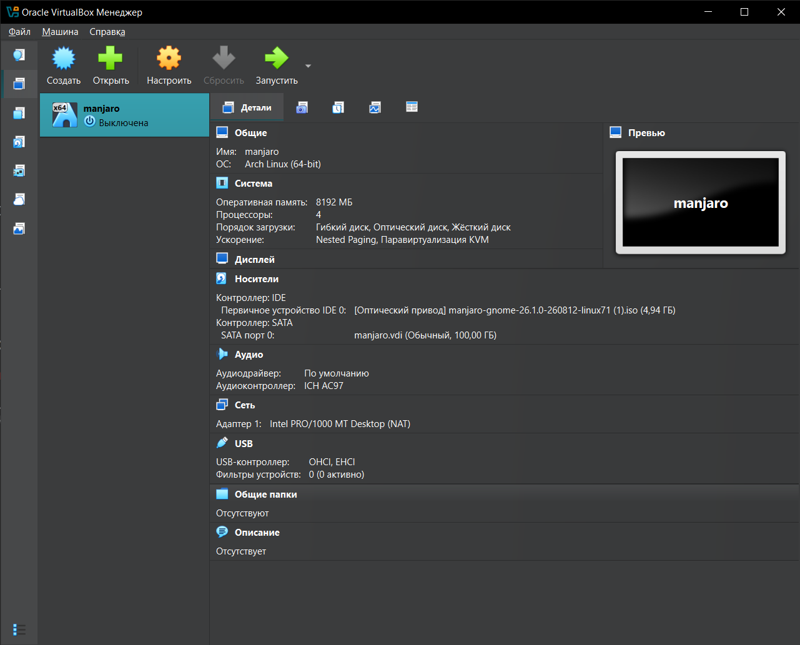

## 5. Первый запуск Manjaro

Выделите ВМ и нажмите **Запустить**. Откроется загрузочное меню ISO Manjaro.


Выберите **Boot with open source drivers** и нажмите **Enter**. Виртуальная Manjaro видит контроллер **VMSVGA**, а не физическую NVIDIA или AMD напрямую, поэтому проприетарный драйвер видеокарты основного компьютера внутри ВМ не нужен.

После загрузки откроются рабочий стол Live-системы и окно **Manjaro Hello**.

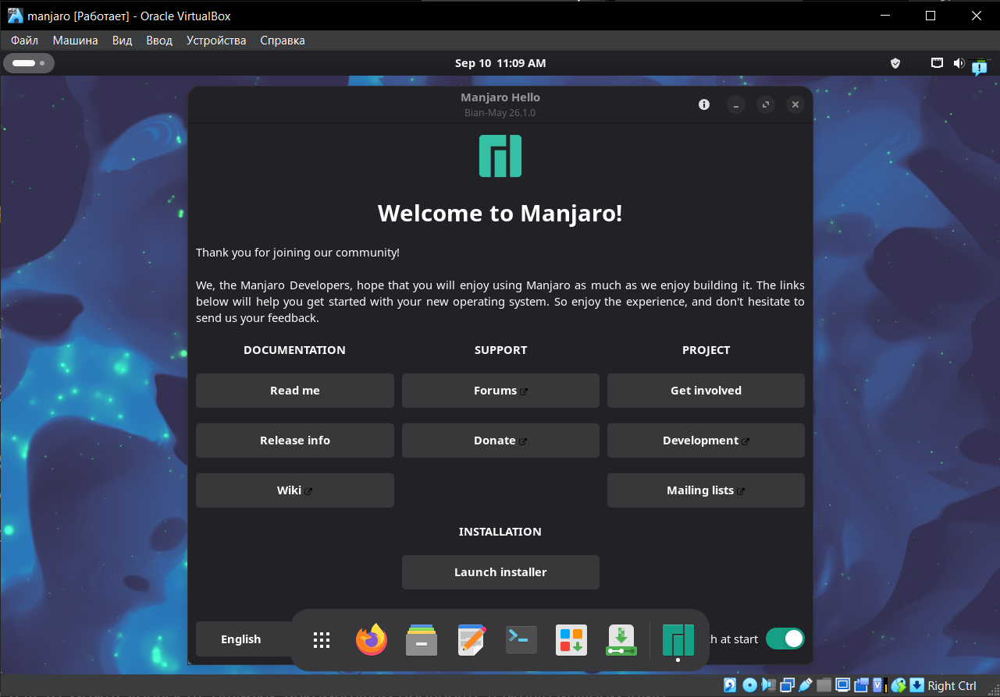

В левом нижнем углу выберите **Русский**, затем нажмите **Launch installer**.

## 6. Установка Manjaro на виртуальный диск

В установщике последовательно выберите:

1. язык — **Русский**;
2. регион и часовой пояс;
3. основную раскладку — **English (US), Default**;
4. способ разметки — **Стереть накопитель**;
5. swap — **Файл подкачки**;
6. файловую систему — **ext4**;
7. шифрование — выключено, если оно специально не требуется;
8. имя пользователя, имя компьютера и пароль;
9. офисный пакет — **No Office Suite**.

> [!IMPORTANT]
> На странице разметки должен быть выбран **VBOX HARDDISK** объёмом 100 ГБ (`/dev/sda`). Очистка этого виртуального диска удаляет только содержимое создаваемой ВМ и не затрагивает диск Windows.

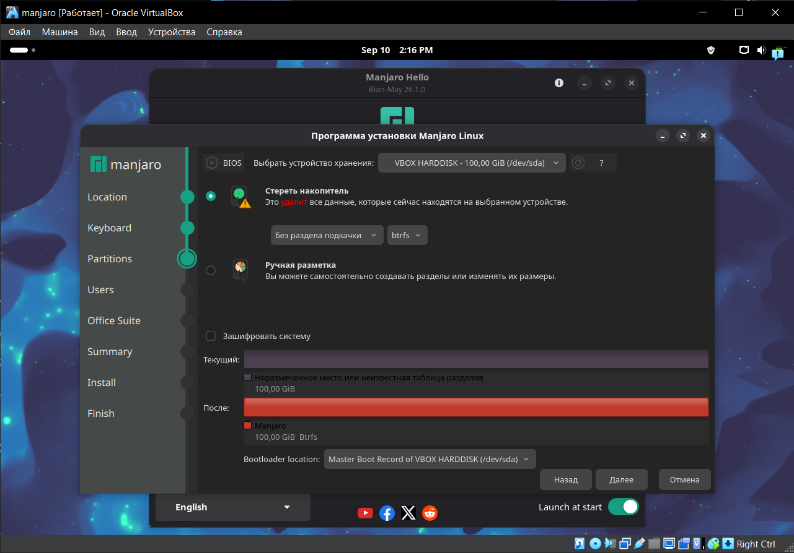

На снимке выше ещё выбраны `btrfs` и вариант без swap. Для конфигурации этого пособия перед продолжением измените их на **ext4** и **Файл подкачки**.

Поскольку EFI при создании ВМ было выключено, загрузчик устанавливается в **Master Boot Record of VBOX HARDDISK (`/dev/sda`)**. Это нормально для данного маршрута.

На странице **Summary** внимательно проверьте диск, пользователя, часовой пояс и способ разметки. Нажмите **Установить**, подтвердите **Установить сейчас** и дождитесь завершения. Затем выберите перезагрузку.

## 7. Извлечение ISO после установки

VirtualBox может снова загрузить установочный ISO вместо установленной системы. Признак этого — повторное появление меню с пунктами **Boot with open source drivers** и **Boot with proprietary drivers**.

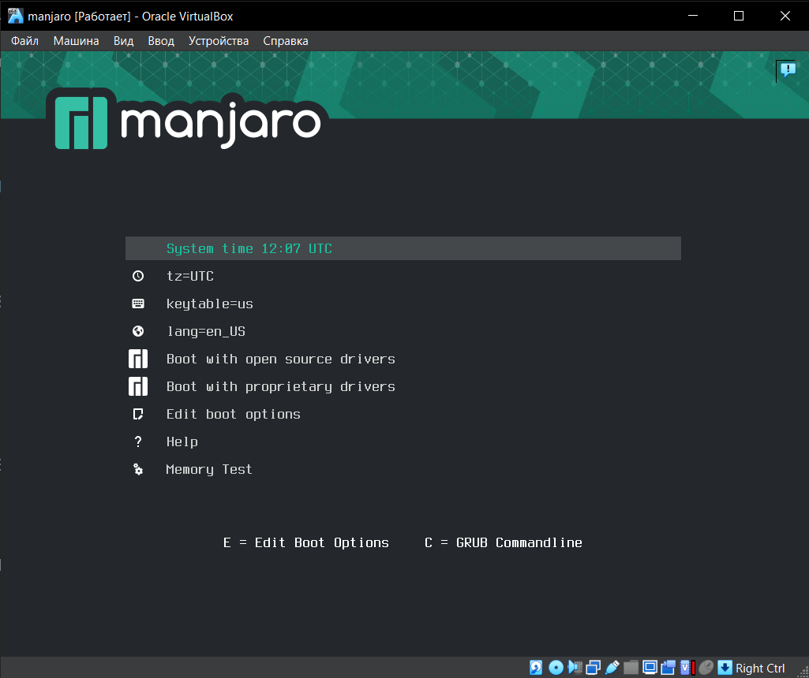

Если это произошло:

1. Закройте окно ВМ и выберите **Выключить машину**. Не выбирайте сохранение состояния.
2. В менеджере VirtualBox откройте **Настроить → Расширенные → Носители**.
3. Под контроллером IDE выберите подключённый ISO Manjaro.

Виртуальный диск `manjaro.vdi` под контроллером SATA не удаляйте: на нём находится установленная система.

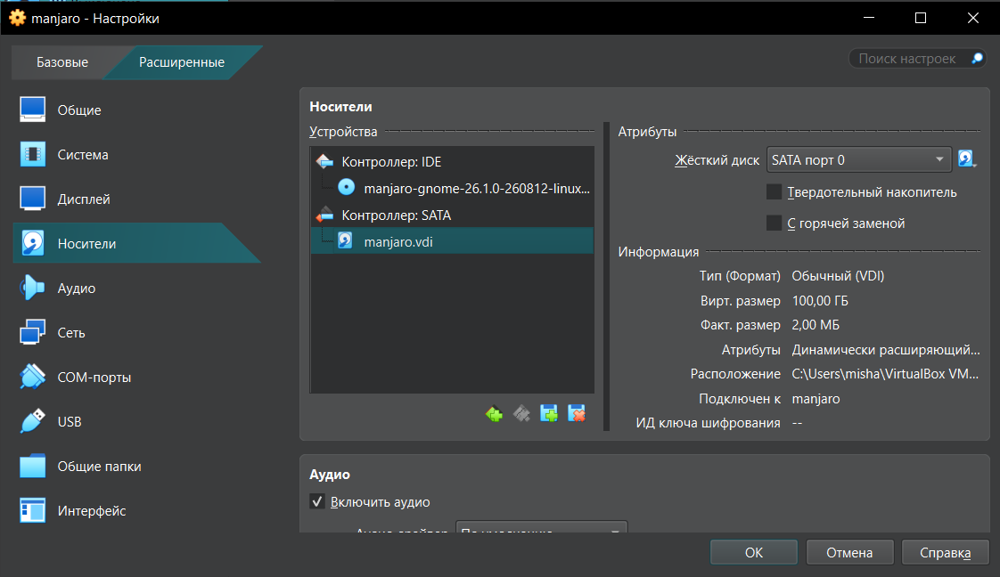

4. Нажмите значок оптического диска справа.
5. Выберите **Изъять диск из виртуального привода**.

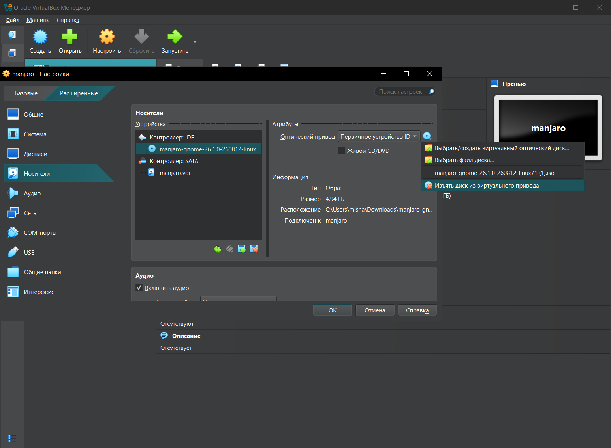

6. Нажмите **ОК** и снова запустите ВМ.

Теперь Manjaro должна загрузиться с виртуального диска. После входа приветственное окно можно закрыть.

## 8. Русская раскладка и горячая клавиша терминала

### Добавить русскую раскладку

Откройте **Настройки → Клавиатура → Источники ввода**, нажмите **+** и добавьте русскую раскладку.

Стандартное сочетание GNOME для переключения раскладки — **Super + Space**. При желании его можно изменить в настройках клавиатуры на привычное сочетание.

### Назначить Ctrl + Alt + T

Проверьте сочетание **Ctrl + Alt + T**. Если терминал не открылся:

1. Откройте **Настройки → Клавиатура → Просмотр и настройка комбинаций клавиш → Пользовательские комбинации**.
2. Нажмите **+**.
3. В поле **Название** укажите любое понятное название, например `Терминал`.
4. В поле **Команда** обязательно укажите:

   ```text
   kgx
   ```

5. Назначьте сочетание **Ctrl + Alt + T** и сохраните его.

`kgx` запускает GNOME Console. Слова «терминал» и «консоль» в этом месте обозначают используемое графическое приложение для командной строки.

## 9. Первое обновление системы

Откройте терминал и выполните:

```bash
sudo pacman -Syu
```

Правильный порядок букв — именно `-Syu`, а не `-Suy`.

Введите пароль и дождитесь завершения. Символы пароля в терминале не отображаются — это нормально. Если система спрашивает о продолжении, подтвердите действие клавишей **Enter**.

После большого первого обновления перезагрузите виртуальную Manjaro.

## 10. Guest Additions и общий буфер обмена

Guest Additions обеспечивают автоматическое изменение разрешения, удобное управление мышью, общий буфер обмена и общие папки. В установленной Manjaro нужный пакет часто уже присутствует, поэтому сначала выполните проверку:

```bash
pacman -Q virtualbox-guest-utils
systemctl is-enabled vboxservice.service
systemctl is-active vboxservice.service
```

Нормальный результат содержит установленную версию пакета, затем строки `enabled` и `active`.

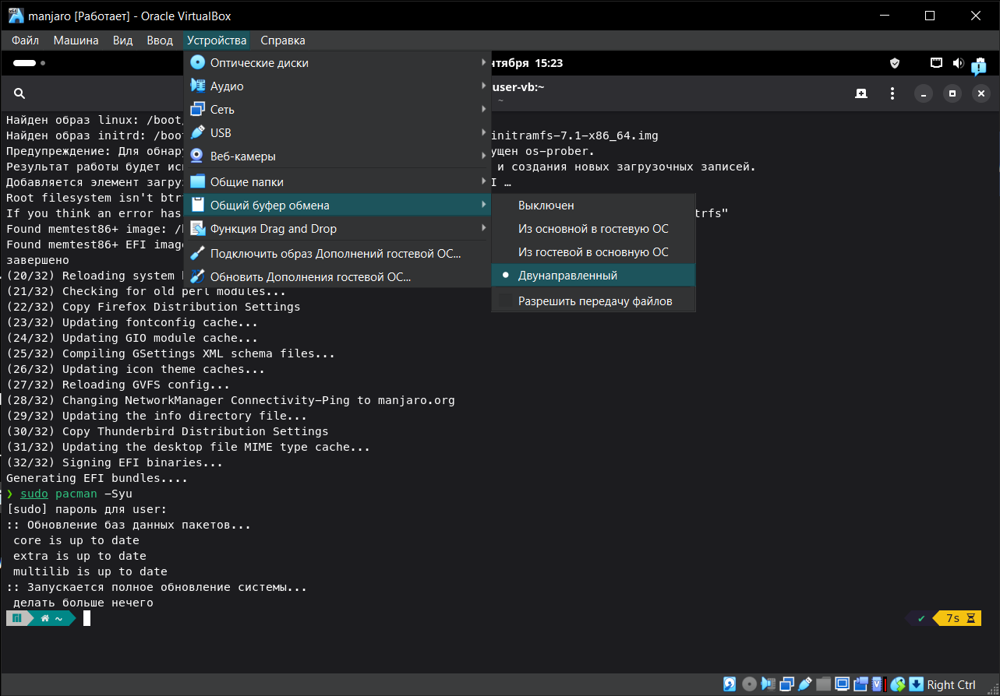

Если пакет не найден или служба не запущена, выполните:

```bash
sudo pacman -Syu virtualbox-guest-utils
sudo systemctl enable --now vboxservice.service
```

После этого перезагрузите ВМ. Подключать пункт **Образ Дополнений гостевой ОС** из меню VirtualBox для Manjaro обычно не требуется: используется пакет из репозитория Manjaro.

### Включить копирование текста

В верхнем меню окна ВМ выберите:

**Устройства → Общий буфер обмена → Двунаправленный**.

Скопируйте текст в Windows и вставьте его в терминал Manjaro сочетанием **Ctrl + Shift + V**. Обычное **Ctrl + V** в терминале не используется для вставки.

## 11. Общая папка между Windows и Manjaro

Общая папка надёжнее функции Drag and Drop и удобна для исходного кода, результатов расчётов и других файлов.

### Создать папку в Windows

Создайте обычную папку, например:

```text
C:\Users\<имя_пользователя>\VM-Shared
```

В проверенной установке использовался путь `C:\Users\misha\VM-Shared`.

### Подключить папку к ВМ

В окне запущенной ВМ откройте **Устройства → Общие папки → Настроить общие папки** и нажмите значок папки с зелёным плюсом.

Укажите:

- **Путь к папке:** созданная папка Windows;
- **Имя папки:** `VM-Shared`;
- **Точка подключения:** оставить пустой;
- **Только для чтения:** выключено;
- **Авто-подключение:** включено;
- **Постоянная для машины:** включено.

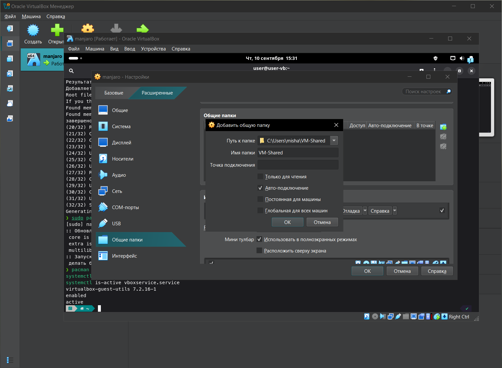

После сохранения папка должна находиться в разделе **Папки машины**, иметь полный доступ и автоматическое подключение.

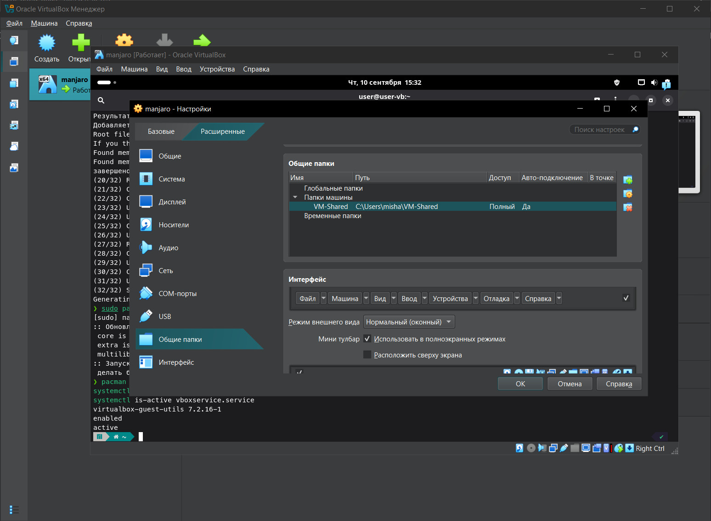

### Выдать пользователю доступ

Проверьте группы текущего пользователя:

```bash
id
```

Если среди них нет `vboxsf`, добавьте пользователя:

```bash
sudo usermod -aG vboxsf "$USER"
```

После добавления в группу перезагрузите виртуальную Manjaro.

При стандартном автоматическом подключении папка появится по адресу:

```text
/media/sf_VM-Shared
```

Проверьте доступ:

```bash
ls -la /media/sf_VM-Shared
```

Если получено сообщение **«Отказано в доступе»**, проверьте права каталога `/media`:

```bash
ls -ld /media
```

Если показаны права `drwxr-x---` и владелец `root root`, разрешите проход к подключённой папке:

```bash
sudo chmod 755 /media
```

Снова выполните:

```bash
ls -la /media/sf_VM-Shared
```

У общей папки должны отображаться владелец `root` и группа `vboxsf`.

### Проверить запись из Manjaro в Windows

Создайте тестовый файл:

```bash
touch /media/sf_VM-Shared/test-from-manjaro.txt
```

Откройте `VM-Shared` в Windows. Если файл `test-from-manjaro.txt` появился, двусторонняя передача файлов работает. Тестовый файл после проверки можно удалить.

## 12. Итоговая проверка

Виртуальная машина готова к установке Geant4, если:

- Manjaro загружается с виртуального диска без установочного ISO;
- ВМ использует 8 ГБ RAM, 4 процессора и динамический диск 100 ГБ либо подходящие ресурсы вашего компьютера;
- выбран VMSVGA, выделено 128 МБ видеопамяти и включено 3D-ускорение;
- добавлена русская раскладка;
- **Ctrl + Alt + T** запускает команду `kgx`;
- `sudo pacman -Syu` завершилось без ошибок;
- Guest Additions установлены, а `vboxservice.service` имеет состояния `enabled` и `active`;
- двунаправленный буфер обмена работает;
- файлы передаются через общую папку в обе стороны.

На этом установка и базовая настройка Manjaro в VirtualBox завершены. Следующий маршрут — установка Geant4 в подготовленной системе.
