# Manjaro рядом с Windows (dual boot)

Этот маршрут предназначен для установки Manjaro второй системой на компьютер, где Windows уже установлена и должна остаться рабочей.

После установки при включении компьютера можно будет выбирать, какую систему запустить: Manjaro или Windows.

> [!CAUTION]
> Самое опасное место в этом маршруте — разметка диска. **Не форматируйте раздел Windows и его служебные разделы.** В примере ниже мы создаём для Manjaro **собственный EFI-раздел** и отдельный корневой раздел.

## Этапы

1. Подготовить Windows
2. Освободить место под Manjaro
3. Скачать Manjaro и Rufus
4. Создать загрузочную флешку
5. Загрузиться с флешки
6. Запустить установщик Manjaro
7. Вручную разметить свободное место
8. Завершить установку
9. Проверить запуск Manjaro и Windows
10. Обновить Manjaro
11. Выполнить итоговую проверку

## 1. Подготовка Windows

### Приостановить BitLocker

Если системный диск зашифрован BitLocker или «Шифрованием устройства», сохраните ключ восстановления и временно приостановите защиту перед изменением разделов.

Проверить состояние можно через:

**Панель управления → Система и безопасность → Шифрование диска BitLocker**.

### Отключить быстрый запуск

Откройте:

**Панель управления → Электропитание → Действия кнопок питания → Изменение параметров, которые сейчас недоступны**.

Снимите галочку **Включить быстрый запуск** и сохраните изменения.

После этого полностью выключите Windows:

```powershell
shutdown /s /t 0
```

## 2. Освобождение места под Manjaro

Место освобождаем средствами самой Windows.

1. Нажмите **Win + X → Управление дисками**.
2. Найдите основной раздел Windows — обычно это **C:**.
3. Нажмите по нему правой кнопкой и выберите **Сжать том**.

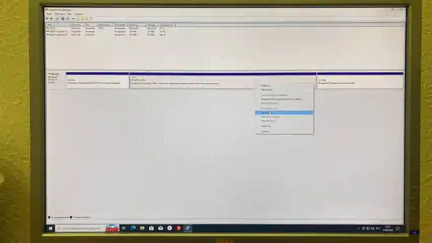

4. Укажите объём, который хотите отдать Manjaro, и подтвердите сжатие.

После этого справа от раздела Windows должна появиться чёрная область **Не распределена**.

В нашем примере под Manjaro освобождено **97,66 ГБ**:

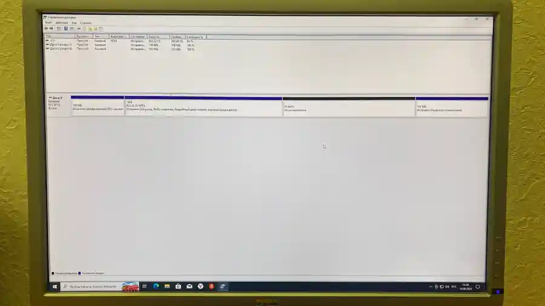

> [!IMPORTANT]
> Ничего не создавайте в этой области средствами Windows и не форматируйте её в NTFS. Она должна остаться **нераспределённой** до запуска установщика Manjaro.

Существующие разделы Windows — EFI, основной NTFS и Recovery — здесь не трогаем.

## 3. Скачивание Manjaro и Rufus

Этот этап такой же, как в ветке [Manjaro как основная система](../01-manjaro/README.md).

### Скачать Manjaro

1. Откройте официальный сайт Manjaro.
2. Выберите редакцию **GNOME**.
3. Скачайте ISO-образ для x86-64.
4. Дождитесь полного окончания загрузки.

Полный образ Manjaro GNOME занимает примерно **5 ГБ**. Если файл весит заметно меньше или имеет расширение `.crdownload` либо `.part`, загрузка ещё не завершилась.

Не распаковывайте ISO-файл и не копируйте его на флешку как обычный файл.

### Скачать Rufus

1. Откройте [официальный сайт Rufus](https://rufus.ie/).
2. Если сайт не открывается, включите VPN и обновите страницу.
3. Пролистайте страницу до раздела **Download**.
4. Выберите актуальную версию Rufus, подходящую для вашей Windows. Для большинства современных компьютеров подходит **Windows x64**.
5. Сохраните `.exe` в папку загрузок.

## 4. Создание загрузочной флешки

> [!CAUTION]
> Все файлы на выбранной флешке будут удалены.

1. Подключите USB-флешку объёмом не менее 8 ГБ.
2. Запустите Rufus.
3. В поле **Устройство** выберите нужную флешку.
4. Нажмите **ВЫБРАТЬ** и укажите ISO-файл Manjaro.

Rufus может сообщить, что обнаружен образ **ISOHybrid** и будет применён режим записи **DD**. Это нормально — нажмите **OK**.


Перед записью окно должно выглядеть примерно так:

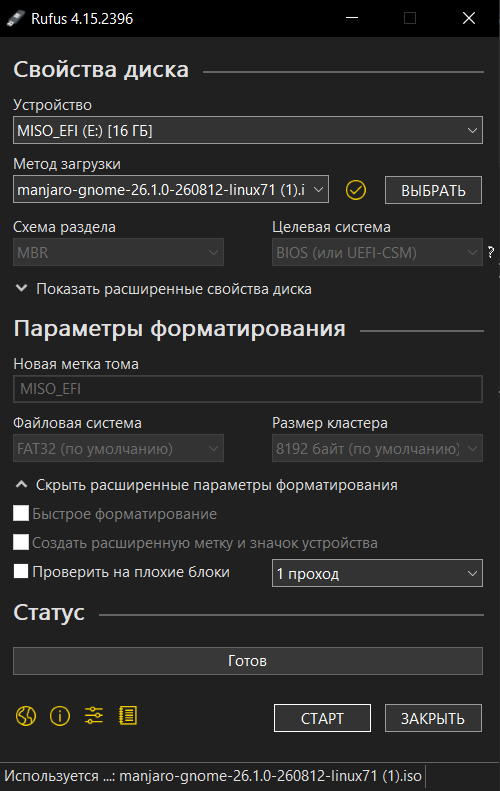

Проверьте:

- **Устройство** — выбрана именно нужная флешка;
- **Метод загрузки** — выбран ISO Manjaro.

5. Нажмите **СТАРТ**.
6. Подтвердите удаление данных на флешке.
7. Дождитесь окончания записи.

> [!WARNING]
> После записи Windows может предложить отформатировать флешку. Нажмите **Отмена**.

Когда Rufus снова покажет состояние **Готов**, флешка записана.

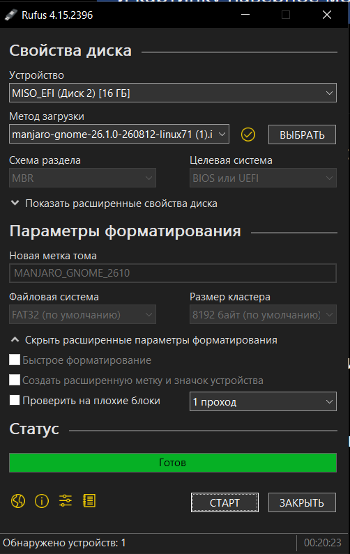

## 5. Загрузка с флешки

### Войти в BIOS/UEFI

1. Полностью выключите компьютер.
2. Подключите загрузочную флешку.
3. Включите компьютер и сразу несколько раз нажимайте клавишу входа в BIOS/UEFI. Чаще всего это **Delete** или **F2**.

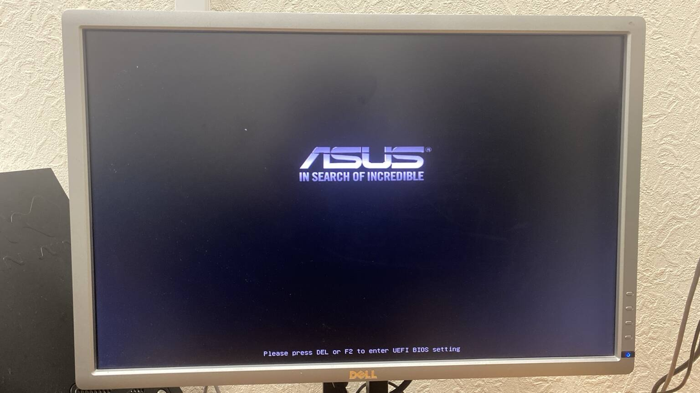

После входа откроется BIOS/UEFI.


Если открыт **EZ Mode**, перейдите в **Advanced Mode**. На плате из примера для этого используется **F7**.

### Отключить Secure Boot

1. Откройте раздел **Boot**.
2. Найдите **Secure Boot**.

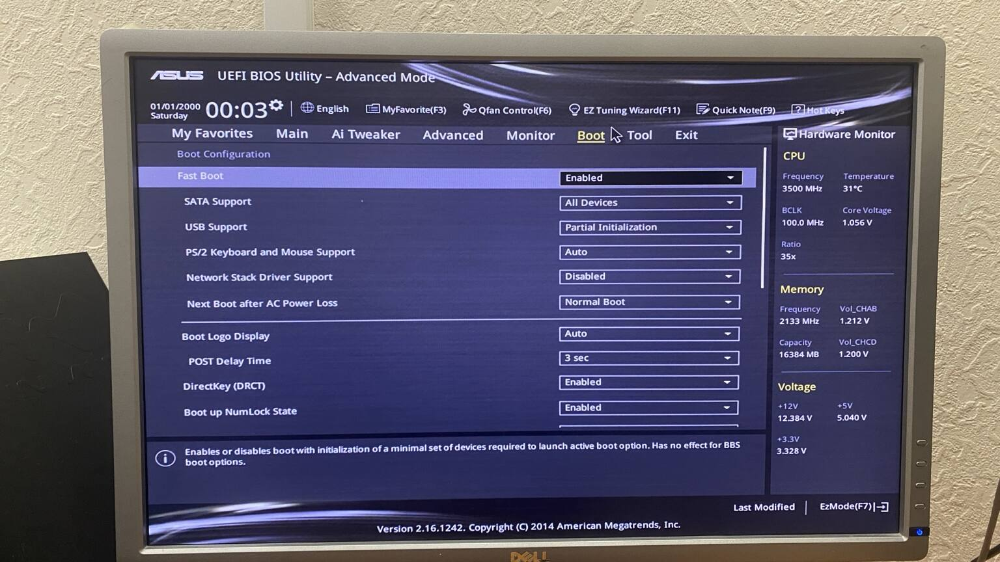

На плате из примера **OS Type** изначально установлен в **Windows UEFI mode**.

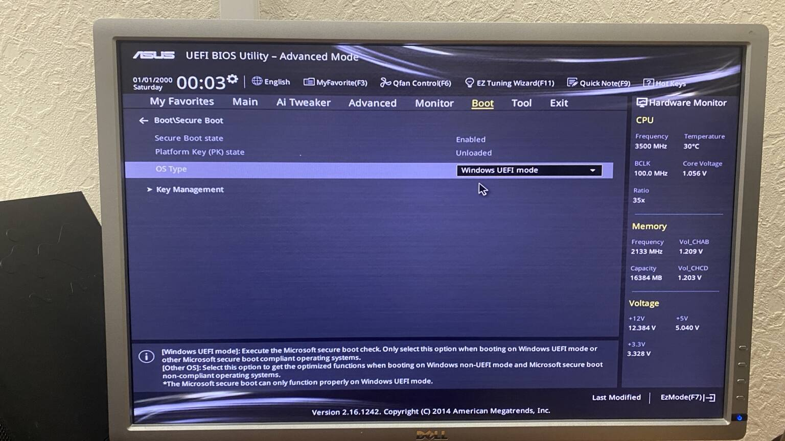

3. Измените **OS Type** на **Other OS**. На других платах вместо этого может быть отдельный параметр **Secure Boot → Disabled**.

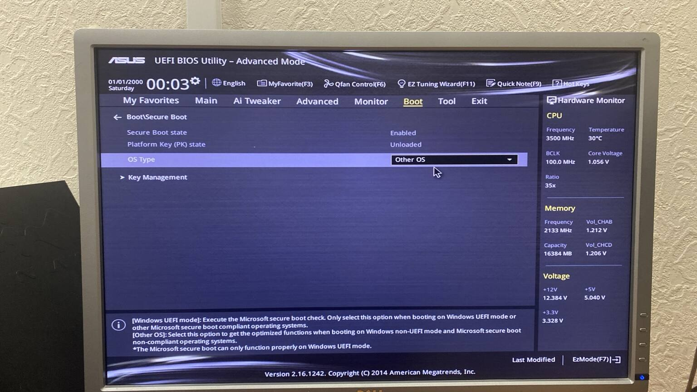

### Поставить флешку первой в очереди загрузки

1. Найдите **Boot Option Priorities / Boot Priority / Boot Order**.
2. Для **Boot Option #1** выберите флешку. Если она отображается несколько раз, выбирайте вариант **UEFI: <название флешки>**.
3. Внутренний диск оставьте вторым.

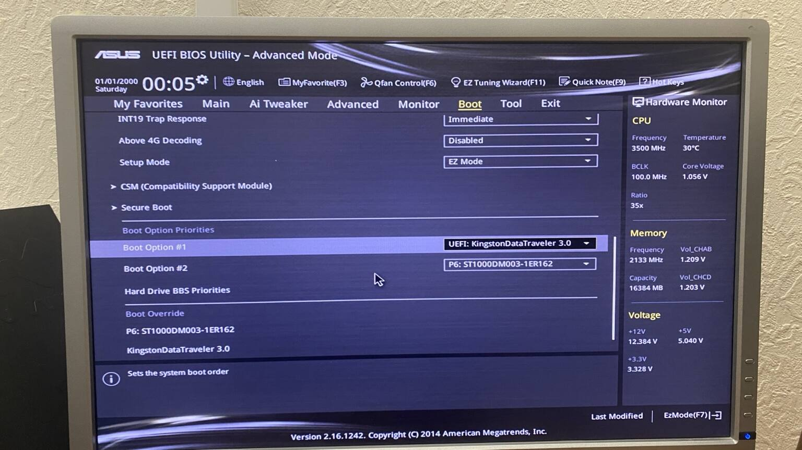

4. Нажмите **F10 → Save & Exit**.

### Выбрать видеодрайвер

После перезагрузки откроется меню Manjaro.

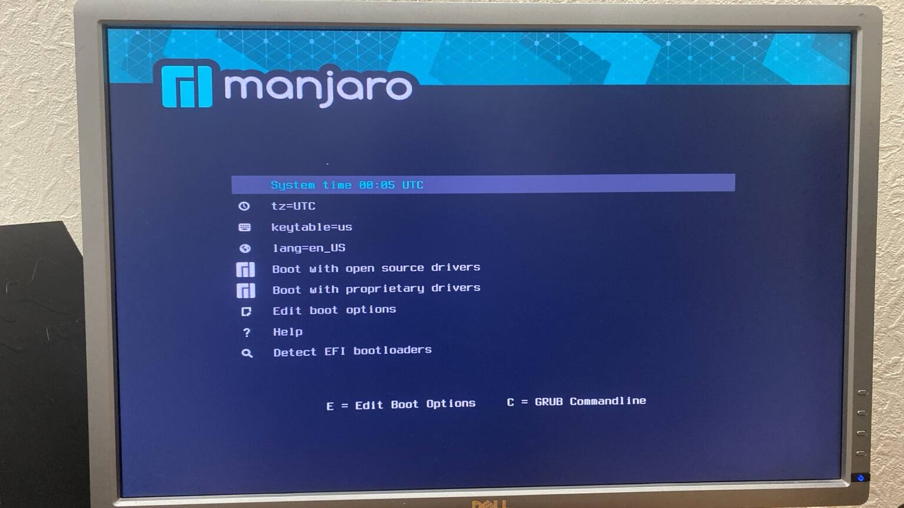

- **Intel** — **Boot with open source drivers**;
- **AMD Radeon** — **Boot with open source drivers**;
- **NVIDIA GeForce** — обычно **Boot with proprietary drivers**;
- если появляется чёрный экран или зависание, перезагрузитесь и попробуйте второй вариант.

После загрузки откроется рабочий стол Manjaro и окно **Manjaro Hello**.


Выберите **Русский** и нажмите **Launch installer**.

## 6. Начальные страницы установщика

### Язык

Выберите **Русский** и нажмите **Далее**.

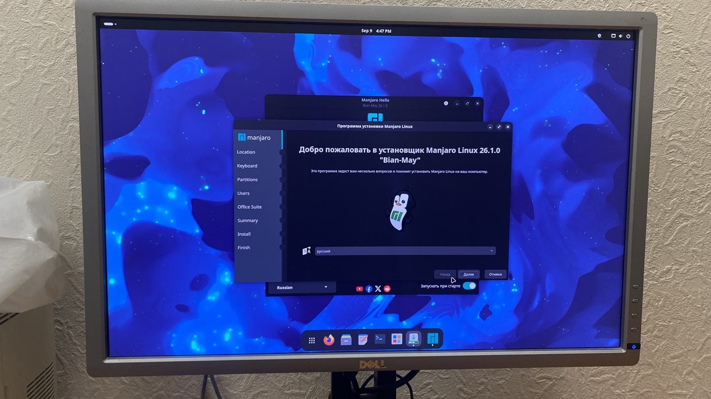

### Регион и часовой пояс

Укажите свой регион и часовой пояс.

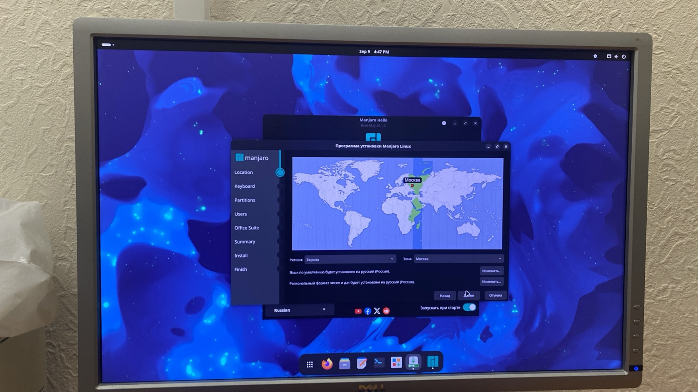

### Раскладка клавиатуры

В качестве основной раскладки выберите **English (US), Default**.


Русскую раскладку добавим уже после установки.

## 7. Ручная разметка диска

На странице **Разделы** выберите **Ручная разметка**.

> [!CAUTION]
> **Не выбирайте «Стереть накопитель».** Windows должна остаться на диске.

В нашем примере до установки на диске уже находятся:

- `/dev/sda1` — **Windows Boot Manager**, FAT32, 100 МиБ;
- `/dev/sda2` — служебный раздел Windows, 16 МиБ;
- `/dev/sda3` — основной раздел Windows, NTFS;
- `/dev/sda4` — Recovery, NTFS, 533 МиБ;
- около **97,66 ГиБ** свободного пространства, которое мы подготовили в Windows.

Существующие четыре раздела **не меняем и не форматируем**.

### Создать собственный EFI-раздел Manjaro

В свободном месте создайте новый раздел примерно **512 МиБ**:

- файловая система — **FAT32**;
- назначение/флаг — **EFI System / boot / esp**;
- точка монтирования — **`/boot/efi`**;
- форматирование — **включено**, потому что это новый раздел Manjaro.

> [!IMPORTANT]
> Здесь мы **не используем EFI-раздел Windows**. Его оставляем нетронутым и создаём отдельный EFI-раздел специально для Manjaro.

### Создать корневой раздел Manjaro

Из всего оставшегося свободного места создайте второй раздел:

- файловая система — **ext4**;
- точка монтирования — **`/`**;
- форматирование — **включено**.

В нашем примере после разметки получилось:

- Windows EFI — 100 МиБ, без изменений;
- Windows служебный раздел — 16 МиБ, без изменений;
- Windows NTFS — 833,22 ГиБ, без изменений;
- **новый EFI Manjaro — 512,83 МиБ FAT32 → `/boot/efi`**;
- **новый root Manjaro — 97,16 ГиБ ext4 → `/`**;
- Windows Recovery — 533 МиБ, без изменений.

Итоговая разметка должна выглядеть так:

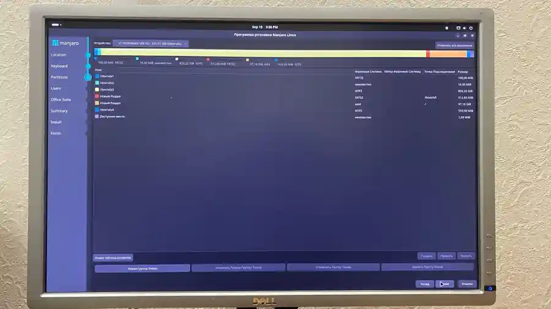

Перед нажатием **Далее** проверьте ещё раз:

- Windows NTFS не форматируется;
- Windows EFI не форматируется;
- Recovery и служебный раздел Windows не изменяются;
- новый FAT32-раздел смонтирован как `/boot/efi`;
- новый ext4-раздел смонтирован как `/`;
- форматируются только **два новых раздела Manjaro**.

## 8. Завершение установки

### Создание пользователя

Заполните имя пользователя, имя компьютера и пароль.

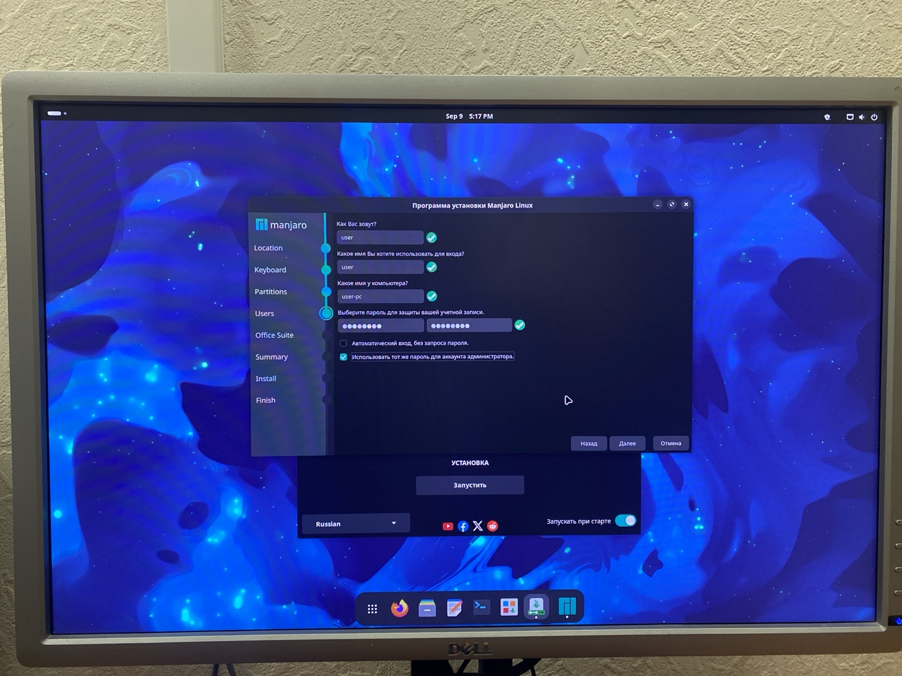

Автоматический вход лучше не включать. Галочку **Использовать тот же пароль для аккаунта администратора** можно оставить включённой.

### Офисный пакет

Для Geant4 офисный пакет не требуется, поэтому выбираем **No Office Suite**.


### Summary

На странице **Summary** внимательно проверьте список изменений.

В dual boot должны форматироваться только два созданных нами раздела Manjaro:

- FAT32 `/boot/efi`;
- ext4 `/`.

Разделы Windows должны остаться без форматирования.

После проверки нажмите **Установить → Установить сейчас** и дождитесь завершения.

Когда появится сообщение **Готово**, выберите перезагрузку.


Во время перезагрузки извлеките установочную флешку.

## 9. Первый запуск и выбор системы

После перезагрузки запустите Manjaro и убедитесь, что система стартует с внутреннего диска без установочной флешки.

Затем перезагрузите компьютер и проверьте запуск Windows через **Windows Boot Manager**.

Если обе системы запускаются, dual boot работает корректно.

## 10. Первое обновление Manjaro

Откройте терминал и выполните:

```bash
sudo pacman -Syu
```

Введите пароль и дождитесь окончания обновления.

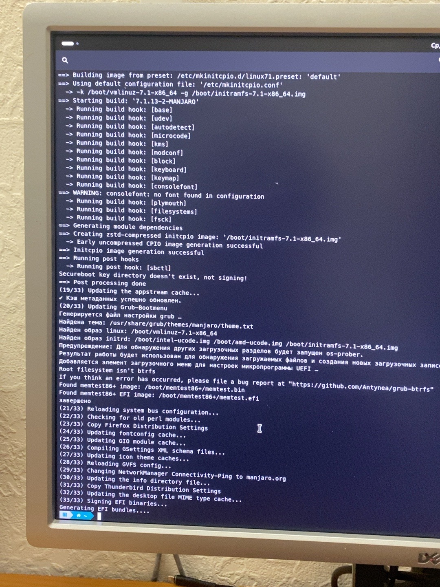

После большого обновления перезагрузите компьютер.

Русскую раскладку можно добавить через:

**Настройки → Клавиатура → Источники ввода**.

Если **Ctrl + Alt + T** не открывает терминал, создайте пользовательское сочетание для команды:

```text
kgx
```

## 11. Итоговая проверка

Dual boot готов, если:

- компьютер загружается без установочной флешки;
- Manjaro запускается;
- Windows запускается;
- раздел Windows сохранился и открывается;
- Manjaro использует свой EFI-раздел `/boot/efi`;
- корневой раздел Manjaro смонтирован как `/`;
- `sudo pacman -Syu` завершается без ошибок.

Проверить точки монтирования можно командой:

```bash
findmnt / /boot/efi
```

На этом установка Manjaro рядом с Windows завершена.