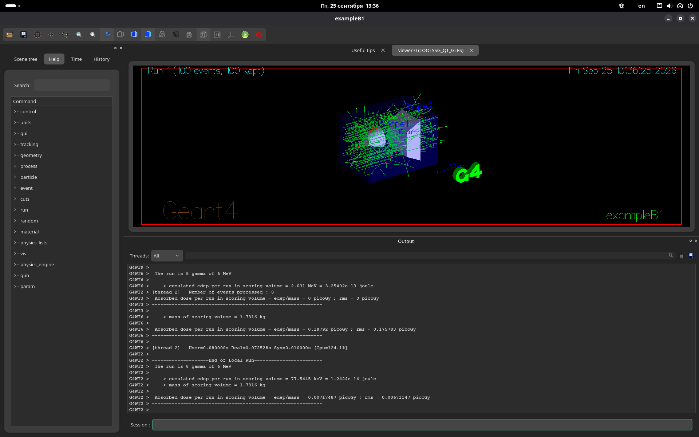

# Установка Geant4 на Manjaro

Этот маршрут выполняется после установки и базовой настройки Manjaro.

Здесь устанавливаются `yay`, Geant4, его наборы физических данных и проверяется стандартный пример `B1`.

## 1. Обновление системы

Обновите систему:

```bash
sudo pacman -Syu
```

Если обновилось ядро или большое количество системных пакетов, перезагрузите компьютер.

## 2. Инструменты для сборки AUR-пакетов

Установите стандартные инструменты разработки, Git и CMake:

```bash
sudo pacman -S --needed base-devel git cmake
```

## 3. Установка yay

Скачайте пакет:

```bash
git clone https://aur.archlinux.org/yay.git
cd yay
```

Соберите и установите:

```bash
makepkg -si
```

После установки:

```bash
cd ..
rm -rf yay
```

Проверьте:

```bash
yay --version
```

## 4. Установка Geant4

Установите Geant4 из AUR:

```bash
yay -S geant4
```

Во время установки можно оставить стандартные ответы `yay`, если установка выполняется впервые.

> [!NOTE]
> Geant4 собирается из исходного кода, поэтому установка может занять десятки минут. Пока в терминале появляются строки `Building CXX object`, сборка продолжается.

В конце успешной установки вывод выглядит примерно так:

```text
==> Finished making: geant4 ...
...
(1/1) installing geant4
```

Номера версии и часть служебных строк могут отличаться. Главное — сборка завершилась без `ERROR` и пакет `geant4` был установлен.

После установки проверьте версию:

```bash
geant4-config --version
```

На проверенной системе установился Geant4 11.4.2.

## 5. Установка физических данных Geant4

Пакет `geant4` из AUR не устанавливает все наборы физических данных автоматически. Для нормальной работы примеров и дальнейших проектов установите используемые Geant4 datasets:

```bash
yay -S \
  geant4-neutronhpdata \
  geant4-ledata \
  geant4-levelgammadata \
  geant4-radioactivedata \
  geant4-particlexsdata \
  geant4-piidata \
  geant4-realsurfacedata \
  geant4-saiddata \
  geant4-abladata \
  geant4-incldata \
  geant4-ensdfstatedata \
  geant4-channelingdata
```

Посмотрите список datasets, которые ожидает установленный Geant4:

```bash
geant4-config --datasets
```

Вывод имеет вид «dataset — переменная окружения — путь», например:

```text
G4NDL G4NEUTRONHPDATA /usr/share/Geant4/data/G4NDL4.7.1
G4EMLOW G4LEDATA /usr/share/Geant4/data/G4EMLOW8.8
PhotonEvaporation G4LEVELGAMMADATA /usr/share/Geant4/data/PhotonEvaporation6.1.2
RadioactiveDecay G4RADIOACTIVEDATA /usr/share/Geant4/data/RadioactiveDecay6.1.2
G4PARTICLEXS G4PARTICLEXSDATA /usr/share/Geant4/data/G4PARTICLEXS4.2
G4PII G4PIIDATA /usr/share/Geant4/data/G4PII1.3
RealSurface G4REALSURFACEDATA /usr/share/Geant4/data/RealSurface2.2
G4SAIDDATA G4SAIDXSDATA /usr/share/Geant4/data/G4SAIDDATA2.0
G4ABLA G4ABLADATA /usr/share/Geant4/data/G4ABLA3.3
G4INCL G4INCLDATA /usr/share/Geant4/data/G4INCL1.3
G4ENSDFSTATE G4ENSDFSTATEDATA /usr/share/Geant4/data/G4ENSDFSTATE3.0
G4CHANNELING G4CHANNELINGDATA /usr/share/Geant4/data/G4CHANNELING2.0
```

Версии каталогов могут меняться вместе с Geant4. Отдельные AUR-пакеты datasets могут хранить данные в других каталогах; фактические пути к ним задаются переменными окружения на следующем шаге.

## 6. Подключение переменных окружения datasets

AUR-пакеты с datasets создают свои скрипты в `/etc/profile.d/`. В `zsh` подключим их автоматически при открытии терминала.

Добавьте в конец `~/.zshrc`:

```bash
cat >> ~/.zshrc <<'EOF'

# Geant4 datasets
for f in /etc/profile.d/geant4-*.sh; do
    [ -r "$f" ] && source "$f"
done
EOF
```

Примените изменения:

```bash
source ~/.zshrc
```

Проверьте одну из переменных:

```bash
echo $G4ENSDFSTATEDATA
```

Она должна содержать путь к установленному набору данных, например:

```text
/usr/share/geant4-ensdfstatedata/G4ENSDFSTATE3.0
```

## 7. Сборка стандартного примера B1

Скопируйте пример в домашнюю папку:

```bash
cp -r /usr/share/Geant4/examples/basic/B1 ~/geant4-B1
```

Перейдите в него и создайте каталог сборки:

```bash
cd ~/geant4-B1
mkdir build
cd build
```

Настройте проект:

```bash
cmake ..
```

При успешной конфигурации конец вывода выглядит примерно так:

```text
-- Found Geant4: /usr/lib/cmake/Geant4/Geant4Config.cmake (found version "11.4.2")
-- Configuring done
-- Generating done
-- Build files have been written to: /home/<user>/geant4-B1/build
```

Версия и имя пользователя в пути могут отличаться.

Соберите B1:

```bash
cmake --build . -j$(nproc)
```

Успешная сборка заканчивается строкой вида:

```text
[100%] Built target exampleB1
```

После этого в каталоге `build` появится `exampleB1`.

## 8. Запуск B1

Проверьте тип графической сессии:

```bash
echo $XDG_SESSION_TYPE
```

### Если вывод `wayland`

Убедитесь, что установлен XWayland:

```bash
sudo pacman -S --needed xorg-xwayland
```

Запускайте B1 через XWayland:

```bash
QT_QPA_PLATFORM=xcb ./exampleB1
```

Это позволяет избежать проблем Qt/OpenGL, которые могут появляться при прямом запуске стандартной визуализации Geant4 под Wayland.

### Если вывод `x11`

Запускайте обычной командой:

```bash
./exampleB1
```

После запуска должно открыться графическое окно Geant4 с геометрией примера.

## 9. Проверка расчёта

В нижней строке `Session:` окна Geant4 выполните:

```text
/run/beamOn 100
```

В окне должны появиться траектории частиц, а в выводе — завершение расчёта 100 событий.



Для другого количества событий измените число, например:

```text
/run/beamOn 1000
```

> [!NOTE]
> При большом числе событий визуализатор может сообщить, что для просмотра сохранены только 100 событий. Это ограничение визуализации; расчёт выполняется для всего числа, указанного в `/run/beamOn`.

## 10. Итоговая проверка

Установка готова, если:

- `geant4-config --version` выводит версию Geant4;
- `geant4-config --datasets` показывает установленные datasets;
- `echo $G4ENSDFSTATEDATA` выводит путь к данным;
- `cmake ..` и сборка B1 завершаются без ошибок;
- B1 открывается с графической визуализацией;
- `/run/beamOn 100` успешно рассчитывает 100 событий.

После этого Geant4 готов для дальнейших проектов и лабораторных работ.
